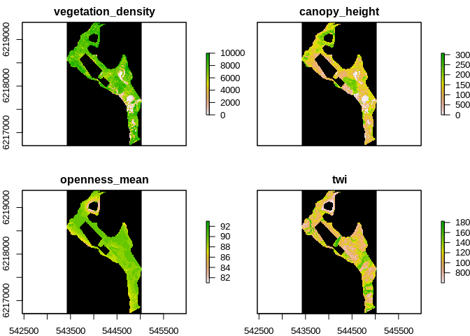
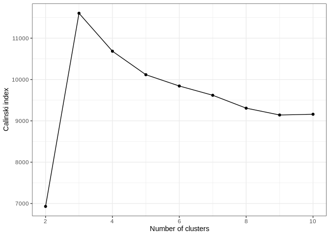
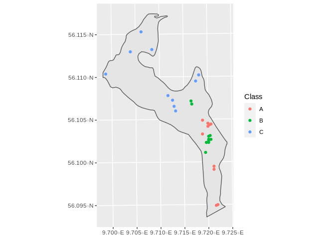

Site selection for Rye Nørskov
================

## Datasets to be used

In order to include Vegetation complexity and wetness in the
startification the following layers were used:

-   vegetation height
    (“O:/Nat\_Ecoinformatics-tmp/au634851/dk\_lidar\_backup\_2021-06-28/canopy\_height”)
-   vegetation density
    (“O:/Nat\_Ecoinformatics-tmp/au634851/dk\_lidar\_backup\_2021-06-28/vegetation\_density”)
-   vegetation openness
    ("“O:/Nat\_Ecoinformatics-tmp/au634851/dk\_lidar\_backup\_2021-06-28/openness\_mean”)
-   TWI
    ("“O:/Nat\_Ecoinformatics-tmp/au634851/dk\_lidar\_backup\_2021-06-28/twi”)

Which resulted in this stack

<!-- -->

## Packages used

The `raster` package was used for layer processing, sf for managing
shapefiles and the package `GeoStratR` was used for the stratification
of the site,

## Raster preparation

The preparation of rasters was made in the ‘Prepare\_rasters.r’ in order
to get all the rasters in the same resolution and crs

## Stratification

The `Stratify` function from GeoSratR was used in order to test the best
stratification from 2 to 10 groups, with the following results

In the graph bellow we can see that the number of classes that best
captures the variablity is 3 as seen in the following graph

<!-- -->

The Resulting raster of classes is the following:

<!-- -->

Which leads to the following number of cells per class:

| Class |    n |
|:------|-----:|
| A     | 3122 |
| B     | 1382 |
| C     | 5848 |

## Sampling desing

### Experimental plots

First we will generate 4 experimental plot groups at each class,
consisting of a fenced 15 by 15 meter point and and accompaning
monitoring plot. In order to do that we will generate 4 random points
with at least 40 meters from each other and from the border using the
`Random_Stratified_Min_Dist` function from the `GeoStratR` package:

``` r
#set seed for reproducibility


set.seed(2021)

Experimental <- Random_Stratified_Min_Dist(ClassRaster = FinalStack,
                           MinDist = 20,
                           n = 10,
                           n_to_test = 700)
```

    ## 
    ##  A  B  C 
    ## 10 10 10

Which can be seen here:

<!-- -->

    ## NULL

The sampling points are available in the `Sampling` folder

    ## Warning in dir.create("Sampling"): 'Sampling' already exists

Ranked plots

<!-- -->

    ## NULL
