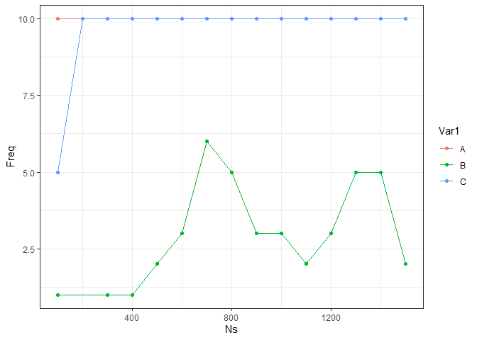

Site selection for Rye Nørskov
================

## Datasets to be used

In order to include Vegetation complexity and wetness in the
startification the following layers were used:

  - vegetation height
    (“O:/Nat\_Ecoinformatics-tmp/au634851/dk\_lidar\_backup\_2021-06-28/canopy\_height”)
  - vegetation density
    (“O:/Nat\_Ecoinformatics-tmp/au634851/dk\_lidar\_backup\_2021-06-28/vegetation\_density”)
  - vegetation openness
    ("“O:/Nat\_Ecoinformatics-tmp/au634851/dk\_lidar\_backup\_2021-06-28/openness\_mean”)
  - TWI
    ("“O:/Nat\_Ecoinformatics-tmp/au634851/dk\_lidar\_backup\_2021-06-28/twi”)

Which resulted in this stack

<!-- -->

## Packages used

The `raster` package was used for layer processing, sf for managing
shapefiles and the package `GeoStratR` was used for the stratification
of the site,

## Raster preparation

The preparation of rasters was made in the ‘Prepare\_rasters.r’ in order
to get all the rasters in the same resolution and crs

## Stratification

The `Stratify` function from GeoSratR was used in order to test the best
stratification from 2 to 10 groups, with the following results

In the graph bellow we can see that the number of classes that best
captures the variablity is 3 as seen in the following graph

<!-- -->

The Resulting raster of classes is the following:

<!-- -->

Which leads to the following number of cells per class:

| Class |    n |
| :---- | ---: |
| A     | 2633 |
| B     | 3189 |
| C     | 6288 |

## Sampling desing

With the following code we will generate 20 random points for sampling
withing each class:

``` r
#set seed for reproducibility
set.seed(2021)
# Take the final raster
Sampling <- FinalStackDF %>% 
  ## Divide it by classes
  group_split(Class) %>% 
  ## get 20 random points
  purrr::map(slice_sample, n = 20) %>% 
  ## join everything
  purrr::reduce(bind_rows) %>% 
  ## Select the relevant variables
  dplyr::select(x,y, Class) %>% 
  ## transform to a spatial object
  st_as_sf(coords = c("x", "y"), crs = "+proj=utm +zone=32 +ellps=GRS80 +units=m +no_defs")
```

Which can be seen here:

<!-- -->

    ## NULL

The sampling points are available in the `Sampling` folder
